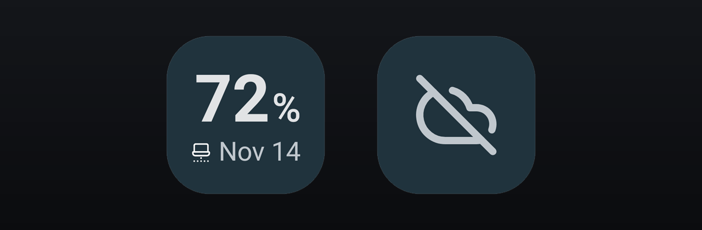

# Codex Meter

Local Android widget and Windows tray controller in Kotlin and Node.js to show the remaining weekly Codex usage from the Codex app-server.

A 1x1 Android widget shows the percentage left of your weekly Codex allowance and its reset date. A
Windows controller asks the local Codex CLI for the weekly rate limit and serves only that value
over HTTPS on your private Wi-Fi network; the phone pairs with it once by scanning a QR code. There
is no cloud service, account system, telemetry, history or notification. Codex Meter is an
unofficial companion: it is not affiliated with or endorsed by OpenAI, and Codex and ChatGPT are
marks of OpenAI.



## Requirements

- Windows 11 (tested on 25H2) with Node.js 22 or newer in the `PATH`.
- The Codex CLI, installed and signed in. The controller reads usage through its
  [app-server protocol](https://developers.openai.com/codex/app-server/).
- An Android 8.0 or newer phone on the same private Wi-Fi network, with Google Play services (the
  QR scanner comes from them).

## Installation and usage

The [latest release](https://github.com/grumitos/codex-meter/releases/latest) is a ZIP with two
files:

1. On the PC, double-click `Codex-Meter-Windows.exe`. It opens the pairing page and stays in the
   notification area: hover the icon for the last confirmed connection state, click it to reopen
   the pairing page and right-click it to exit.
2. On the phone, install `Codex-Meter.apk`, open Codex Meter, tap **Scan QR code** and scan the code
   shown on the PC. Pairing transfers a random key and a certificate fingerprint, not a Codex
   credential. It is needed only once per PC.
3. Add the 1x1 Codex Meter widget to the home screen. Tap it to refresh; Android also refreshes it
   about every 30 minutes. When the PC cannot be reached, the widget replaces the number with a
   single offline symbol.

To run the controller from the source instead of the EXE, run `run.bat` (with a double click or
from a terminal). The first time it installs the bridge dependencies (`npm ci --omit=dev`). Then it
starts the controller, which opens the pairing page in your browser and keeps running in that
window until you press Ctrl+C. If a controller is already running, it only reopens the pairing
page. The window pauses at the end only if something fails.

Without the launcher:

```bat
cd bridge
npm ci --omit=dev
set CODEX_METER_RUN=1
node src\windows-app.mjs
```

`run.bat` accepts these options and rejects any other argument instead of starting the controller:

| Option | Effect |
| --- | --- |
| `--self-test FILE` | writes the selected private address and the Node.js version to `FILE` and exits without starting the servers |
| `--help` | shows the usage and exits |

The pairing key, the certificate, the last usage value and `controller.log` live in
`%LOCALAPPDATA%\CodexMeter`. `run.bat` exits with code 1 if Node.js is missing, the dependencies
cannot be installed or the controller fails (the cause is printed or appended to `controller.log`),
with 2 for invalid arguments, and with 0 otherwise, including when you stop the controller with
Ctrl+C.

## How it works

The controller starts `codex app-server` over its standard input and output and reads the weekly
rate-limit window. It ignores the five-hour window and shows no history or estimates. It listens
on two ports:

- `4317`: HTTPS on the selected private LAN address, for signed usage requests from the phone;
- `4318`: the pairing page, on `127.0.0.1` only.

The QR code encodes the LAN address, the request key and the certificate pin, so it stays the same
while that pairing identity and address do not change. The widget refreshes when tapped and through
a 30-minute [WorkManager](https://developer.android.com/develop/background-work/background-tasks/persistent)
job; if the PC cannot be reached it keeps the last valid value internally and shows the offline
state. The scope is deliberately small: no historical charts, multiple accounts, credits,
notifications, relay or web scraping.

## Android and One UI themes

The widget follows the host launcher instead of imposing a skin. It is built with
[Jetpack Glance](https://developer.android.com/develop/ui/compose/glance), whose theme roles
(`widgetBackground`, `onSurface`, `onSurfaceVariant`) give light, dark and dynamic colors.
Android 12 and newer use the system widget corner radius, the system font and locale format the
text and the reset date, and the adaptive app icon has a monochrome layer for themed icons. Exact
colors and shapes therefore differ between launchers, wallpapers, Android versions and
manufacturers, such as Pixel and Samsung One UI. The screenshot shows the default dark theme.

## Languages

English, Spanish, Portuguese, French, German, Japanese, Korean and Simplified Chinese are supported,
with English as the fallback. The Android app and the widget dates follow the phone language and
region, the tray follows the Windows interface language and the pairing page follows the browser
language.

## Development

Building needs Node.js 22 or newer, JDK 17 or newer, the Android SDK 36 (set `ANDROID_HOME` or
create `android/local.properties` with `sdk.dir`) and ADB to install on a device.

```powershell
.\scripts\build-apk.ps1     # unit tests, lint and a debug APK in dist\Codex-Meter.apk
.\scripts\install-apk.ps1   # installs that APK on the only connected ADB device

cd bridge
npm ci
cd ..
.\scripts\build-windows.ps1 # dist\Codex-Meter-Windows.exe
```

`build-windows.ps1` bundles the bridge with esbuild and embeds it in a small .NET Framework tray
launcher built with the `csc.exe` that ships with Windows. The launcher starts the bridge with the
Node.js runtime that the Codex CLI already requires.

## Privacy

Codex credentials never leave Windows. At pairing time the phone receives only a random 256-bit
request key and the fingerprint of the controller's self-signed certificate. Android keeps the key
in the Android Keystore, pins that certificate and excludes the pairing data from backups. Every
usage request carries a timestamp, a nonce and an HMAC signature; expired, replayed, unsigned and
incorrectly signed requests are rejected. The controller returns only this payload:

```json
{
  "remainingPercent": 65,
  "resetsAt": "2026-08-03T05:00:00.000Z",
  "stale": false
}
```

The controller sends nothing outward: it only asks the local Codex CLI, which uses your existing
sign-in. Its data stays in `%LOCALAPPDATA%\CodexMeter`, outside the repository. There is no relay,
no internet-facing listener and no telemetry, so use Codex Meter only on a private network you
trust. The screenshot in `docs/screenshots/` was rendered from the widget code with sample data.

## Tests

The bridge tests use Node's test runner and the Android tests use JUnit. They need no phone,
Codex account or internet connection: the Codex process and the clock are replaced by test doubles,
servers listen only on loopback and files go to temporary directories.

```bat
cd bridge
npm ci
npm test

cd ..\android
gradlew.bat testDebugUnitTest
```

## Structure

```text
android/            Android app (Kotlin, Jetpack Glance): Gradle project
  app/src/main/     widget, pairing screen, background refresh, resources in 8 languages
  app/src/test/     unit tests: gradlew.bat testDebugUnitTest
bridge/             Windows controller (Node.js)
  src/              usage service, HTTPS and pairing servers, .NET tray launcher
  test/             tests: npm test
  scripts/          Windows icon generation for the EXE build
scripts/            build and install scripts for the APK and the Windows EXE
docs/               screenshot of the widget
run.bat             launcher for Windows: installs the dependencies, starts the controller
```

## License

[MIT](LICENSE).
